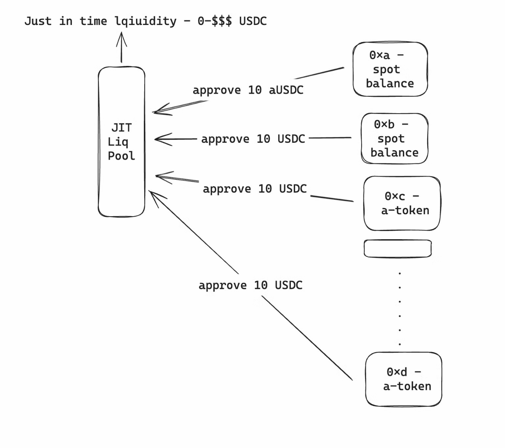

# JITLiq Network Contracts

Liquidity is widespread, often held in spot markets or locked within protocols like Aave. However, locked liquidity can lead to underutilization and become challenging to manage, especially across hundreds of chains, including bridges. The Just-In-Time (JIT) Pool addresses this by removing the need for locked liquidity. Instead, it only provides the required amount precisely when needed, allowing users to retain full access to their assets while still participating in the pool.

The JITLiq Network leverages staking to securely grant access to the pool's liquidity. The process is straightforward: participants stake their assets, which are then synchronized across both the source and destination chains. This synchronization ensures consistency and security throughout the network. Access to the pool is limited to the amount each participant has staked, meaning solvers can only draw liquidity equivalent to their staked amount. This mechanism not only secures the funds but also aligns incentives, ensuring responsible usage of the pool's resources.

[**Technical explainer**](https://bit.ly/JITLiq)

## Protocols Used

-   **LayerZero**: to create an OApp (omnichain app) that communicates across chains for managing bridging & settlement of funds
-   **Circle CCTP**: to bridge funds for reverse settlement of LP funds
-   **Arbitrum, Base, Flow**: contract deployments

## Deployments

### Arbitrum One (42161)

| Contract Name        | Address                                                                                                              |
| -------------------- | -------------------------------------------------------------------------------------------------------------------- |
| AddressRegistry      | [0x53D2A5e9a88A716954A6fc8fF4fF5e35995BDF09](https://arbiscan.io/address/0x53D2A5e9a88A716954A6fc8fF4fF5e35995BDF09) |
| SourceEntrypoint     | [0x1cc004C9357c7E32F2b36203224B21a4C0c47B95](https://arbiscan.io/address/0x1cc004C9357c7E32F2b36203224B21a4C0c47B95) |
| SourceOpStateManager | [0xa21ec45a60bC6a11BF56FccC431d9CaDEf6Ae367](https://arbiscan.io/address/0xa21ec45a60bC6a11BF56FccC431d9CaDEf6Ae367) |

### Base (8453)

| Contract Name      | Address                                                                                                               |
| ------------------ | --------------------------------------------------------------------------------------------------------------------- |
| AddressRegistry    | [0x9c9c9D8131D5A8151e89F6Af23234057acED0ea3](https://basescan.org/address/0x9c9c9D8131D5A8151e89F6Af23234057acED0ea3) |
| DestOpStateManager | [0x2BB5Ab403FC9b71bdcA497141F7efe68eaC4876a](https://basescan.org/address/0x2BB5Ab403FC9b71bdcA497141F7efe68eaC4876a) |
| DestEntrypoint     | [0xc62d083faf83f783E01d3f89d913A02cAf4b3120](https://basescan.org/address/0xc62d083faf83f783E01d3f89d913A02cAf4b3120) |

### EVM on Flow Testnet (545)

| Contract Name      | Address                                                                                                                          |
| ------------------ | -------------------------------------------------------------------------------------------------------------------------------- |
| AddressRegistry    | [0xB95c28f4F42ebA3aFee042284fFd77202000A808](https://evm-testnet.flowscan.io/address/0xB95c28f4F42ebA3aFee042284fFd77202000A808) |
| DestOpStateManager | [0xFE4A47a399A76db4dd98bbfb6913C2cC3d585BAf](https://evm-testnet.flowscan.io/address/0xFE4A47a399A76db4dd98bbfb6913C2cC3d585BAf) |
| DestEntrypoint     | [PENDING due to missing layerzero integration]                                                                                   |

## License

[MIT](./LICENSE)
